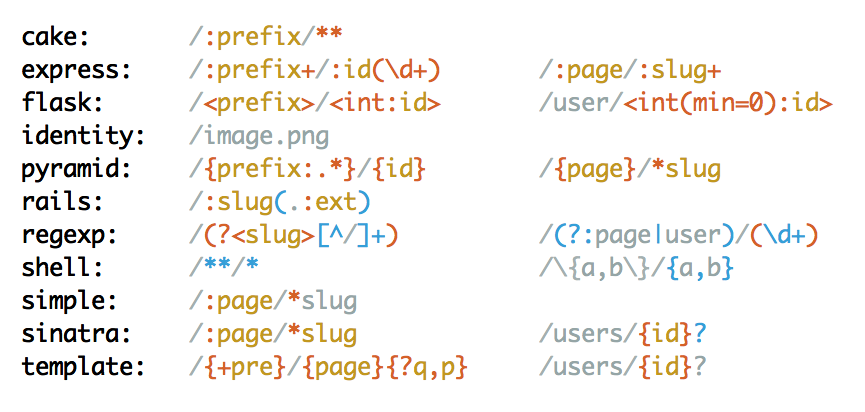

# The Amazing Mustermann - Contrib Edition

This is a meta gem that depends on all mustermann gems.

``` console
$ gem install mustermann-contrib
Successfully installed mustermann-1.0.0
Successfully installed mustermann-contrib-1.0.0
...
```

Also handy for your `Gemfile`:

``` ruby
gem 'mustermann-contrib'
```

Alternatively, you can use latest HEAD from github:

```ruby
github 'sinatra/mustermann' do
  gem 'mustermann'
  gem 'mustermann-contrib'
end
```

<a name="-mustermann-cake"></a>
# CakePHP Syntax for Mustermann

This gem implements the `cake` pattern type for Mustermann. It is compatible with [CakePHP](http://cakephp.org/) 2.x and 3.x.

## Overview

**Supported options:**
`capture`, `except`, `greedy`, `space_matches_plus`, `uri_decode`, and `ignore_unknown_options`.

**External documentation:**
[CakePHP 2.0 Routing](http://book.cakephp.org/2.0/en/development/routing.html),
[CakePHP 3.0 Routing](http://book.cakephp.org/3.0/en/development/routing.html)

CakePHP patterns feature captures and unnamed splats. Captures are prefixed with a colon and splats are either a single asterisk (parsing segments into an array) or a double asterisk (parsing segments as a single string).

``` ruby
require 'mustermann/cake'

Mustermann.new('/:name/*',  type: :cake).params('/a/b/c') # => { name: 'a', splat: ['b', 'c'] }
Mustermann.new('/:name/**', type: :cake).params('/a/b/c') # => { name: 'a', splat: 'b/c' }

pattern = Mustermann.new('/:name')

pattern.respond_to? :expand # => true
pattern.expand(name: 'foo') # => '/foo'

pattern.respond_to? :to_templates # => true
pattern.to_templates              # => ['/{name}']
```

## Syntax

<table>
  <thead>
    <tr>
      <th>Syntax Element</th>
      <th>Description</th>
    </tr>
  </thead>
  <tbody>
    <tr>
      <td><b>:</b><i>name</i></td>
      <td>
        Captures anything but a forward slash in a semi-greedy fashion. Capture is named <i>name</i>.
        Capture behavior can be modified with <tt>capture</tt> and <tt>greedy</tt> option.
      </td>
    </tr>
    <tr>
      <td><b>*</b></td>
      <td>
        Captures anything in a non-greedy fashion. Capture is named splat.
        It is always an array of captures, as you can use it more than once in a pattern.
      </td>
    </tr>
    <tr>
      <td><b>**</b></td>
      <td>
        Captures anything in a non-greedy fashion. Capture is named splat.
        It is always an array of captures, as you can use it more than once in a pattern.
        The value matching a single <tt>**</tt> will be split at slashes when parsed into <tt>params</tt>.
      </td>
    </tr>
    <tr>
      <td><b>/</b></td>
      <td>
        Matches forward slash. Does not match URI encoded version of forward slash.
      </td>
    </tr>
    <tr>
      <td><i>any other character</i></td>
      <td>Matches exactly that character or a URI encoded version of it.</td>
    </tr>
  </tbody>
</table>


<a name="-mustermann-express"></a>
# Express Syntax for Mustermann

This gem implements the `express` pattern type for Mustermann. It is compatible with [Express](http://expressjs.com/) and [pillar.js](https://pillarjs.github.io/).

## Overview

**Supported options:**
`capture`, `except`, `greedy`, `space_matches_plus`, `uri_decode`, and `ignore_unknown_options`.

**External documentation:**
[path-to-regexp](https://github.com/pillarjs/path-to-regexp#path-to-regexp),
[live demo](http://forbeslindesay.github.io/express-route-tester/)

Express patterns feature named captures (with repetition support via suffixes) that start with a colon and can have an optional regular expression constraint or unnamed captures that require a constraint.

``` ruby
require 'mustermann/express'

Mustermann.new('/:name/:rest+', type: :express).params('/a/b/c') # => { name: 'a', rest: 'b/c' }

pattern = Mustermann.new('/:name', type: :express)

pattern.respond_to? :expand # => true
pattern.expand(name: 'foo') # => '/foo'

pattern.respond_to? :to_templates # => true
pattern.to_templates              # => ['/{name}']
```

## Syntax

<table>
  <thead>
    <tr>
      <th>Syntax Element</th>
      <th>Description</th>
    </tr>
  </thead>
  <tbody>
    <tr>
      <td><b>:</b><i>name</i></td>
      <td>
        Captures anything but a forward slash in a semi-greedy fashion. Capture is named <i>name</i>.
        Capture behavior can be modified with <tt>capture</tt> and <tt>greedy</tt> option.
      </td>
    </tr>
    <tr>
      <td><b>:</b><i>name</i><b>+</b></td>
      <td>
        Captures one or more segments (with segments being separated by forward slashes).
        Capture is named <i>name</i>.
        Capture behavior can be modified with <tt>capture</tt> option.
      </td>
    </tr>
    <tr>
      <td><b>:</b><i>name</i><b>*</b></td>
      <td>
        Captures zero or more segments (with segments being separated by forward slashes).
        Capture is named <i>name</i>.
        Capture behavior can be modified with <tt>capture</tt> option.
      </td>
    </tr>
    <tr>
      <td><b>:</b><i>name</i><b>?</b></td>
      <td>
        Captures anything but a forward slash in a semi-greedy fashion. Capture is named <i>name</i>.
        Also matches an empty string.
        Capture behavior can be modified with <tt>capture</tt> and <tt>greedy</tt> option.
      </td>
    </tr>
    <tr>
      <td><b>:</b><i>name</i><b>(</b><i>regexp</i><b>)</b></td>
      <td>
        Captures anything matching the <i>regexp</i> regular expression. Capture is named <i>name</i>.
        Capture behavior can be modified with <tt>capture</tt>.
      </td>
    </tr>
    <tr>
      <td><b>(</b><i>regexp</i><b>)</b></td>
      <td>
        Captures anything matching the <i>regexp</i> regular expression. Capture is named splat.
        Capture behavior can be modified with <tt>capture</tt>.
      </td>
    </tr>
    <tr>
      <td><b>/</b></td>
      <td>
        Matches forward slash. Does not match URI encoded version of forward slash.
      </td>
    </tr>
    <tr>
      <td><i>any other character</i></td>
      <td>Matches exactly that character or a URI encoded version of it.</td>
    </tr>
  </tbody>
</table>

<a name="-mustermann-fileutils"></a>
# FileUtils for Mustermann

This gem implements efficient file system operations for Mustermann patterns.

## Globbing

All operations work on a list of files described by one or more pattern.

``` ruby
require 'mustermann/file_utils'

Mustermann::FileUtils[':base.:ext'] # => ['example.txt']

Mustermann::FileUtils.glob(':base.:ext') do |file, params|
  file   # => "example.txt"
  params # => {"base"=>"example", "ext"=>"txt"}
end
```

To avoid having to loop over all files and see if they match, it will generate a glob pattern resembling the Mustermann pattern as closely as possible.

``` ruby
require 'mustermann/file_utils'

Mustermann::FileUtils.glob_pattern('/:name')                  # => '/*'
Mustermann::FileUtils.glob_pattern('src/:path/:file.(js|rb)') # => 'src/**/*/*.{js,rb}'
Mustermann::FileUtils.glob_pattern('{a,b}/*', type: :shell)   # => '{a,b}/*'

pattern = Mustermann.new('/foo/:page', '/bar/:page') # => #<Mustermann::Composite:...>
Mustermann::FileUtils.glob_pattern(pattern)          # => "{/foo/*,/bar/*}"
```

## Mapping

It is also possible to search for files and have their paths mapped onto another path in one method call:

``` ruby
require 'mustermann/file_utils'

Mustermann::FileUtils.glob_map(':base.:ext' => ':base.bak.:ext') # => {'example.txt' => 'example.bak.txt'}
Mustermann::FileUtils.glob_map(':base.:ext' => :base) { |file, mapped| mapped } # => ['example']
```

This mechanism allows things like copying, renaming and linking files:

``` ruby
require 'mustermann/file_utils'

# copies example.txt to example.bak.txt
Mustermann::FileUtils.cp(':base.:ext' => ':base.bak.:ext')

# copies Foo.app/example.txt to Foo.back.app/example.txt
Mustermann::FileUtils.cp_r(':base.:ext' => ':base.bak.:ext')

# creates a symbolic link from bin/example to lib/example.rb
Mustermann::FileUtils.ln_s('lib/:name.rb' => 'bin/:name')
```

<a name="-mustermann-flask"></a>
# Flask Syntax for Mustermann

This gem implements the `flask` pattern type for Mustermann. It is compatible with [Flask](http://flask.pocoo.org/) and [Werkzeug](http://werkzeug.pocoo.org/).

## Overview

**Supported options:**
`capture`, `except`, `greedy`, `space_matches_plus`, `uri_decode`, `converters` and `ignore_unknown_options`

**External documentation:**
[Werkzeug: URL Routing](http://werkzeug.pocoo.org/docs/0.9/routing/)

``` ruby
require 'mustermann/flask'

Mustermann.new('/<prefix>/<path:page>', type: :flask).params('/a/b/c') # => { prefix: 'a', page: 'b/c' }

pattern = Mustermann.new('/<name>', type: :flask)

pattern.respond_to? :expand # => true
pattern.expand(name: 'foo') # => '/foo'

pattern.respond_to? :to_templates # => true
pattern.to_templates              # => ['/{name}']
```

## Syntax

<table>
  <thead>
    <tr>
      <th>Syntax Element</th>
      <th>Description</th>
    </tr>
  </thead>
  <tbody>
    <tr>
      <td><b>&lt;</b><i>name</i><b>&gt;</b></td>
      <td>
        Captures anything but a forward slash in a semi-greedy fashion. Capture is named <i>name</i>.
        Capture behavior can be modified with <tt>capture</tt> and <tt>greedy</tt> option.
      </td>
    </tr>
    <tr>
      <td><b>&lt;</b><i>converter</i><b>:</b><i>name</i><b>&gt;</b></td>
      <td>
        Captures depending on the converter constraint. Capture is named <i>name</i>.
        Capture behavior can be modified with <tt>capture</tt> and <tt>greedy</tt> option.
        See below.
      </td>
    </tr>
    <tr>
      <td><b>&lt;</b><i>converter</i><b>(</b><i>arguments</i><b>):</b><i>name</i><b>&gt;</b></td>
      <td>
        Captures depending on the converter constraint. Capture is named <i>name</i>.
        Capture behavior can be modified with <tt>capture</tt> and <tt>greedy</tt> option.
        Arguments are separated by comma. An argument can be a simple string, a string enclosed
        in single or double quotes, or a key value pair (keys and values being separated by an
        equal sign). See below.
      </td>
    </tr>
    <tr>
      <td><b>/</b></td>
      <td>
        Matches forward slash. Does not match URI encoded version of forward slash.
      </td>
    </tr>
    <tr>
      <td><i>any other character</i></td>
      <td>Matches exactly that character or a URI encoded version of it.</td>
    </tr>
  </tbody>
</table>

## Converters

### Builtin Converters

#### `string`

Possible arguments: `minlength`, `maxlength`, `length`

Captures anything but a forward slash in a semi-greedy fashion.
Capture behavior can be modified with <tt>capture</tt> and <tt>greedy</tt> option.

This is also the default converter.

Examples:

```
<name>
<string:name>
<string(minlength=3,maxlength=10):slug>
<string(length=10):slug>
```

#### `int`

Possible arguments: `min`, `max`, `fixed_digits`

Captures digits.
Captured value will be converted to an Integer.

Examples:

```
<int:id>
<int(min=1,max=5):page>
<int(fixed_digits=16):uuid>
```

#### `float`

Possible arguments: `min`, `max`

Captures digits with a dot.
Captured value will be converted to an Float.

Examples:

```
<float:precision>
<float(min=0,max=1):precision>
```

#### `path`

Captures anything in a non-greedy fashion.

Example:

```
<path:rest>
```

#### `any`

Possible arguments: List of accepted strings.

Captures anything that matches one of the arguments exactly.

Example:

```
<any(home,search,contact):page>
```

### Custom Converters

[Flask patterns](#-pattern-details-flask) support registering custom converters.

A converter object may implement any of the following methods:

* `convert`: Should return a block converting a string value to whatever value should end up in the `params` hash.
* `constraint`: Should return a regular expression limiting which input string will match the capture.
* `new`: Returns an object that may respond to `convert` and/or `constraint` as described above. Any arguments used for the converter inside the pattern will be passed to `new`.

``` ruby
require 'mustermann/flask'

SimpleConverter = Struct.new(:constraint, :convert)
id_converter    = SimpleConverter.new(/\d/, -> s { s.to_i })

class NumConverter
  def initialize(base: 10)
    @base = Integer(base)
  end

  def convert
    -> s { s.to_i(@base) }
  end

  def constraint
    @base > 10 ? /[\da-#{(@base-1).to_s(@base)}]/ : /[0-#{@base-1}]/
  end
end

pattern = Mustermann.new('/<id:id>/<num(base=8):oct>/<num(base=16):hex>',
  type: :flask, converters: { id: id_converter, num: NumConverter})

pattern.params('/10/12/f1') # => {"id"=>10, "oct"=>10, "hex"=>241}
```

### Global Converters

It is also possible to register a converter for all flask patterns, using `register_converter`:

``` ruby
Mustermann::Flask.register_converter(:id,  id_converter)
Mustermann::Flask.register_converter(:num, NumConverter)

pattern = Mustermann.new('/<id:id>/<num(base=8):oct>/<num(base=16):hex>', type: :flask)
pattern.params('/10/12/f1') # => {"id"=>10, "oct"=>10, "hex"=>241}
```

There is a handy syntax for quickly creating new converter classes: When you pass a block instead of a converter object, it will yield a generic converter with setters and getters for `convert` and `constraint`, and any arguments passed to the converter.

``` ruby
require 'mustermann/flask'

Mustermann::Flask.register_converter(:id) do |converter|
  converter.constraint = /\d/
  converter.convert    = -> s { s.to_i }
end

Mustermann::Flask.register_converter(:num) do |converter, base: 10|
  converter.constraint = base > 10 ? /[\da-#{(@base-1).to_s(base)}]/ : /[0-#{base-1}]/
  converter.convert    = -> s { s.to_i(base) }
end

pattern = Mustermann.new('/<id:id>/<num(base=8):oct>/<num(base=16):hex>', type: :flask)
pattern.params('/10/12/f1') # => {"id"=>10, "oct"=>10, "hex"=>241}
```

### Subclassing

Registering global converters will make these available for all Flask patterns. It might even override already registered converters. This global state might break unrelated code.

It is therefore recommended that, if you don't want to pass in the converters option for every pattern, you create your own subclass of `Mustermann::Flask`.

``` ruby
require 'mustermann/flask'

MyFlask = Class.new(Mustermann::Flask)

MyFlask.register_converter(:id) do |converter|
  converter.constraint = /\d/
  converter.convert    = -> s { s.to_i }
end

MyFlask.register_converter(:num) do |converter, base: 10|
  converter.constraint = base > 10 ? /[\da-#{(@base-1).to_s(base)}]/ : /[0-#{base-1}]/
  converter.convert    = -> s { s.to_i(base) }
end

pattern = MyFlask.new('/<id:id>/<num(base=8):oct>/<num(base=16):hex>')
pattern.params('/10/12/f1') # => {"id"=>10, "oct"=>10, "hex"=>241}
```

You can even register this type for usage with `Mustermann.new`:

``` ruby
Mustermann.register(:my_flask, MyFlask)
pattern = Mustermann.new('/<id:id>/<num(base=8):oct>/<num(base=16):hex>', type: :my_flask)
pattern.params('/10/12/f1') # => {"id"=>10, "oct"=>10, "hex"=>241}
```

<a name="-mustermann-pyramid"></a>
# Pyramid Syntax for Mustermann

This gem implements the `pyramid` pattern type for Mustermann. It is compatible with [Pyramid](http://www.pylonsproject.org/projects/pyramid/about) and [Pylons](http://www.pylonsproject.org/projects/pylons-framework/about).

## Overview

**Supported options:**
`capture`, `except`, `greedy`, `space_matches_plus`, `uri_decode` and `ignore_unknown_options`

**External Documentation:** [Pylons Framework: URL Configuration](http://docs.pylonsproject.org/projects/pylons-webframework/en/latest/configuration.html#url-config), [Pylons Book: Routes in Detail](http://pylonsbook.com/en/1.0/urls-routing-and-dispatch.html#routes-in-detail), [Pyramid: Route Pattern Syntax](http://docs.pylonsproject.org/projects/pyramid/en/1.5-branch/narr/urldispatch.html#route-pattern-syntax)

``` ruby
require 'mustermann/pyramid'

Mustermann.new('/{prefix}/*suffix', type: :pyramid).params('/a/b/c') # => { prefix: 'a', suffix: ['b', 'c'] }

pattern = Mustermann.new('/{name}', type: :pyramid)

pattern.respond_to? :expand # => true
pattern.expand(name: 'foo') # => '/foo'

pattern.respond_to? :to_templates # => true
pattern.to_templates              # => ['/{name}']
```

## Syntax


<table>
  <thead>
    <tr>
      <th>Syntax Element</th>
      <th>Description</th>
    </tr>
  </thead>
  <tbody>
    <tr>
      <td><b>&#123;</b><i>name</i><b>&#125;</b></td>
      <td>
        Captures anything but a forward slash in a semi-greedy fashion. Capture is named <i>name</i>.
        Capture behavior can be modified with <tt>capture</tt> and <tt>greedy</tt> option.
      </td>
    </tr>
    <tr>
      <td><b>&#123;</b><i>name</i><b>:</b><i>regexp</i><b>&#125;</b></td>
      <td>
        Captures anything matching the <i>regexp</i> regular expression. Capture is named <i>name</i>.
        Capture behavior can be modified with <tt>capture</tt>.
      </td>
    </tr>
    <tr>
      <td><b>*</b><i>name</i></td>
      <td>
        Captures anything in a non-greedy fashion. Capture is named <i>name</i>.
      </td>
    </tr>
    <tr>
      <td><b>/</b></td>
      <td>
        Matches forward slash. Does not match URI encoded version of forward slash.
      </td>
    </tr>
    <tr>
      <td><i>any other character</i></td>
      <td>Matches exactly that character or a URI encoded version of it.</td>
    </tr>
  </tbody>
</table>

<a name="-mustermann-rails"></a>
# Rails Syntax for Mustermann

This gem implements the `rails` pattern type for Mustermann. It is compatible with [Ruby on Rails](http://rubyonrails.org/), [Journey](https://github.com/rails/journey), the [http_router gem](https://github.com/joshbuddy/http_router), [Lotus](http://lotusrb.org/) and [Scalatra](http://scalatra.org/) (if [configured](http://scalatra.org/2.3/guides/http/routes.html#toc_248))</td>

## Overview

**Supported options:**
`capture`, `except`, `greedy`, `space_matches_plus`, `uri_decode`, `version`, and `ignore_unknown_options`.

**External documentation:**
[Ruby on Rails Guides: Routing](http://guides.rubyonrails.org/routing.html).

``` ruby
require 'mustermann'

pattern = Mustermann.new('/:example', type: :rails)
pattern === "/foo.bar"     # => true
pattern === "/foo/bar"     # => false
pattern.params("/foo.bar") # => { "example" => "foo.bar" }
pattern.params("/foo/bar") # => nil

pattern = Mustermann.new('/:example(/:optional)', type: :rails)
pattern === "/foo.bar"     # => true
pattern === "/foo/bar"     # => true
pattern.params("/foo.bar") # => { "example" => "foo.bar", "optional" => nil   }
pattern.params("/foo/bar") # => { "example" => "foo",     "optional" => "bar" }

pattern = Mustermann.new('/*example', type: :rails)
pattern === "/foo.bar"     # => true
pattern === "/foo/bar"     # => true
pattern.params("/foo.bar") # => { "example" => "foo.bar" }
pattern.params("/foo/bar") # => { "example" => "foo/bar" }
```

## Rails Compatibility

Rails syntax changed over time. You can target different Ruby on Rails versions by setting the `version` option to the desired Rails version.

The default is `4.2`. Versions prior to `2.3` are not supported.

``` ruby
require 'mustermann'
Mustermann.new('/', type: :rails, version: "2.3")
Mustermann.new('/', type: :rails, version: "3.0.0")

require 'rails'
Mustermann.new('/', type: :rails, version: Rails::VERSION::STRING)
```

## Syntax

<table>
  <thead>
    <tr>
      <th>Syntax Element</th>
      <th>Description</th>
    </tr>
  </thead>
  <tbody>
    <tr>
      <td><b>:</b><i>name</i></td>
      <td>
        Captures anything but a forward slash in a semi-greedy fashion. Capture is named <i>name</i>.
        Capture behavior can be modified with tt>capture</tt> and <tt>greedy</tt> option.
      </td>
    </tr>
    <tr>
      <td><b>*</b><i>name</i></td>
      <td>
        Captures anything in a non-greedy fashion. Capture is named <i>name</i>.
      </td>
    </tr>
    <tr>
      <td><b>(</b><i>expression</i><b>)</b></td>
      <td>Enclosed <i>expression</i> is optional. Not available in 2.3 compatibility mode.</td>
    </tr>
    <tr>
      <td><b>/</b></td>
      <td>
        Matches forward slash. Does not match URI encoded version of forward slash.
      </td>
    </tr>
    <tr>
      <td><b>\</b><i>x</i></td>
      <td>
        In 3.x compatibility mode and starting with 4.2:
        Matches <i>x</i> or URI encoded version of <i>x</i>. For instance <tt>\*</tt> matches <tt>*</tt>.<br>
        In 4.0 or 4.1 compatibility mode:
        <b>\</b> is ignored, <i>x</i> is parsed normally.<br>
      </td>
    </tr>
    <tr>
      <td><i>expression</i> <b>|</b> <i>expression</i></td>
      <td>
        3.2+ mode: This will raise a `Mustermann::ParseError`. While Ruby on Rails happily parses this character, it will result in broken routes due to a buggy implementation.<br>
        5.0 mode: It will match if any of the nested expressions matches.
      </td>
    </tr>
    <tr>
      <td><i>any other character</i></td>
      <td>Matches exactly that character or a URI encoded version of it.</td>
    </tr>
  </tbody>
</table>

<a name="-mustermann-shell"></a>
# Shell Syntax for Mustermann

This gem implements the `shell` pattern type for Mustermann. It is compatible with common Unix shells (like bash or zsh).

## Overview

**Supported options:** `uri_decode` and `ignore_unknown_options`.

**External documentation:** [Ruby's fnmatch](http://www.ruby-doc.org/core-2.1.4/File.html#method-c-fnmatch), [Wikipedia: Glob (programming)](http://en.wikipedia.org/wiki/Glob_(programming))

``` ruby
require 'mustermann'

pattern = Mustermann.new('/*', type: :shell)
pattern === "/foo.bar" # => true
pattern === "/foo/bar" # => false

pattern = Mustermann.new('/**/*', type: :shell)
pattern === "/foo.bar" # => true
pattern === "/foo/bar" # => true

pattern = Mustermann.new('/{foo,bar}', type: :shell)
pattern === "/foo"     # => true
pattern === "/bar"     # => true
pattern === "/baz"     # => false
```

## Syntax

<table>
  <thead>
    <tr>
      <th>Syntax Element</th>
      <th>Description</th>
    </tr>
  </thead>
  <tbody>
    <tr>
      <td><b>*</b></td>
      <td>Matches anything but a slash.</td>
    </tr>
    <tr>
      <td><b>**</b></td>
      <td>Matches anything.</td>
    </tr>
    <tr>
      <td><b>[</b><i>set</i><b>]</b></td>
      <td>Matches one character in <i>set</i>.</td>
    </tr>
    <tr>
      <td><b>&#123;</b><i>a</i>,<i>b</i><b>&#125;</b></td>
      <td>Matches <i>a</i> or <i>b</i>.</td>
    </tr>
    <tr>
      <td><b>\</b><i>x</i></td>
      <td>Matches <i>x</i> or URI encoded version of <i>x</i>. For instance <tt>\*</tt> matches <tt>*</tt>.</td>
    </tr>
    <tr>
      <td><i>any other character</i></td>
      <td>Matches exactly that character or a URI encoded version of it.</td>
    </tr>
  </tbody>
</table>


<a name="-mustermann-simple"></a>
# Simple Syntax for Mustermann

This gem implements the `simple` pattern type for Mustermann. It is compatible with [Sinatra](http://www.sinatrarb.com/) (1.x), [Scalatra](http://scalatra.org/) and [Dancer](http://perldancer.org/).

## Overview

**Supported options:**
`greedy`, `space_matches_plus`, `uri_decode` and `ignore_unknown_options`.

This is useful for porting an application that relies on this behavior to a later Sinatra version and to make sure Sinatra 2.0 patterns do not decrease performance. Simple patterns internally use the same code older Sinatra versions used for compiling the pattern. Error messages for broken patterns will therefore not be as informative as for other pattern implementations.

``` ruby
require 'mustermann'

pattern = Mustermann.new('/:example', type: :simple)
pattern === "/foo.bar"     # => true
pattern === "/foo/bar"     # => false
pattern.params("/foo.bar") # => { "example" => "foo.bar" }
pattern.params("/foo/bar") # => nil

pattern = Mustermann.new('/:example/?:optional?', type: :simple)
pattern === "/foo.bar"     # => true
pattern === "/foo/bar"     # => true
pattern.params("/foo.bar") # => { "example" => "foo.bar", "optional" => nil   }
pattern.params("/foo/bar") # => { "example" => "foo",     "optional" => "bar" }

pattern = Mustermann.new('/*', type: :simple)
pattern === "/foo.bar"     # => true
pattern === "/foo/bar"     # => true
pattern.params("/foo.bar") # => { "splat" => ["foo.bar"] }
pattern.params("/foo/bar") # => { "splat" => ["foo/bar"] }
```

## Syntax

<table>
  <thead>
    <tr>
      <th>Syntax Element</th>
      <th>Description</th>
    </tr>
  </thead>
  <tbody>
    <tr>
      <td><b>:</b><i>name</i></td>
      <td>
        Captures anything but a forward slash in a greedy fashion. Capture is named <i>name</i>.
      </td>
    </tr>
    <tr>
      <td><b>*</b></td>
      <td>
        Captures anything in a non-greedy fashion. Capture is named splat.
        It is always an array of captures, as you can use <tt>*</tt> more than once in a pattern.
      </td>
    </tr>
    <tr>
      <td><i>x</i><b>?</b></td>
      <td>Makes <i>x</i> optional. For instance <tt>foo?</tt> matches <tt>foo</tt> or <tt>fo</tt>.</td>
    </tr>
    <tr>
      <td><b>/</b></td>
      <td>
        Matches forward slash. Does not match URI encoded version of forward slash.
      </td>
    </tr>
    <tr>
      <td><i>any special character</i></td>
      <td>Matches exactly that character or a URI encoded version of it.</td>
    </tr>
    <tr>
      <td><i>any other character</i></td>
      <td>Matches exactly that character.</td>
    </tr>
  </tbody>
</table>

<a name="-mustermann-strscan"></a>
# String Scanner for Mustermann

This gem implements `Mustermann::StringScanner`, a tool inspired by Ruby's [`StringScanner`]() class.

``` ruby
require 'mustermann/string_scanner'
scanner = Mustermann::StringScanner.new("here is our example string")

scanner.scan("here") # => "here"
scanner.getch        # => " "

if scanner.scan(":verb our")
  scanner.scan(:noun, capture: :word)
  scanner[:verb]  # => "is"
  scanner[:nound] # => "example"
end

scanner.rest # => "string"
```

You can pass it pattern objects directly:

``` ruby
pattern = Mustermann.new(':name')
scanner.check(pattern)
```

Or have `#scan` (and other methods) check these for you.

``` ruby
scanner.check('{name}', type: :template)
```

You can also pass in default options for ad hoc patterns when creating the scanner:

``` ruby
scanner = Mustermann::StringScanner.new(input, type: :shell)
```

<a name="-mustermann-uri-template"></a>
# URI Template Syntax for Mustermann

This gem implements the `uri-template` (or `template`) pattern type for Mustermann. It is compatible with [RFC 6570](https://tools.ietf.org/html/rfc6570) (level 4), [JSON API](http://jsonapi.org/), [JSON Home Documents](http://tools.ietf.org/html/draft-nottingham-json-home-02) and [many more](https://code.google.com/p/uri-templates/wiki/Implementations)

## Overview

**Supported options:**
`capture`, `except`, `greedy`, `space_matches_plus`, `uri_decode`, and `ignore_unknown_options`.

Please keep the following in mind:

> "Some URI Templates can be used in reverse for the purpose of variable matching: comparing the template to a fully formed URI in order to extract the variable parts from that URI and assign them to the named variables.  Variable matching only works well if the template expressions are delimited by the beginning or end of the URI or by characters that cannot be part of the expansion, such as reserved characters surrounding a simple string expression.  In general, regular expression languages are better suited for variable matching."
> &mdash; *RFC 6570, Sec 1.5: "Limitations"*

``` ruby
require 'mustermann'

pattern = Mustermann.new('/{example}', type: :template)
pattern === "/foo.bar"     # => true
pattern === "/foo/bar"     # => false
pattern.params("/foo.bar") # => { "example" => "foo.bar" }
pattern.params("/foo/bar") # => nil

pattern = Mustermann.new("{/segments*}/{page}{.ext,cmpr:2}", type: :template)
pattern.params("/a/b/c.tar.gz") # => {"segments"=>["a","b"], "page"=>"c", "ext"=>"tar", "cmpr"=>"gz"}
```

## Generating URI Templates

You do not need to use URI templates (and this gem) if all you want is reusing them for hypermedia links. Most other pattern types support generating these (via `#to_pattern`):

``` ruby
require 'mustermann'

Mustermann.new('/:name').to_templates # => ['/{name}']
```

Moreover, Mustermann's default pattern type implements a subset of URI templates (`{capture}` and `{+capture}`) and can therefore also be used for simple templates/

``` ruby
require 'mustermann'

Mustermann.new('/{name}').expand(name: "example") # => "/example"
```

## Syntax

<table>
  <thead>
    <tr>
      <th>Syntax Element</th>
      <th>Description</th>
    </tr>
  </thead>
  <tbody>
    <tr>
      <td><b>&#123;</b><i>o</i> <i>var</i> <i>m</i><b>,</b> <i>var</i> <i>m</i><b>,</b> ...<b>&#125;</b></td>
      <td>
        Captures expansion.
        Operator <i>o</i>: <code>+ # . / ; ? &amp;</tt> or none.
        Modifier <i>m</i>: <code>:num *</tt> or none.
      </td>
    </tr>
    <tr>
      <td><b>/</b></td>
      <td>
        Matches forward slash. Does not match URI encoded version of forward slash.
      </td>
    </tr>
    <tr>
      <td><i>any other character</i></td>
      <td>Matches exactly that character or a URI encoded version of it.</td>
    </tr>
  </tbody>
</table>

The operators `+` and `#` will always match non-greedy, whereas all other operators match semi-greedy by default.
All modifiers and operators are supported. However, it does not parse lists as single values without the *explode* modifier (aka *star*).
Parametric operators (`;`, `?` and `&`) currently only match parameters in given order.

Note that it differs from URI templates in that it takes the unescaped version of special character instead of the escaped version.

If you reuse the exact same templates and expose them via an external API meant for expansion,
you should set `uri_decode` to `false` in order to conform with the specification.


<a name="-mustermann-visualizer"></a>
# Mustermann Pattern Visualizer

With this gem, you can visualize the internal structure of a Mustermann pattern:

* You can generate a **syntax highlighted** version of a pattern object. Both HTML/CSS based highlighting and ANSI color code based highlighting is supported.
* You can turn a pattern object into a **tree** (with ANSI color codes) representing the internal AST. This of course only works for AST based patterns.

## Syntax Highlighting



Loading `mustermann/visualizer` will automatically add `to_html` and `to_ansi` to pattern objects.

``` ruby
require 'mustermann/visualizer'
puts Mustermann.new('/:name').to_ansi
puts Mustermann.new('/:name').to_html
```

Alternatively, you can also create a separate `highlight` object, which allows finer grained control and more formats:

``` ruby
require 'mustermann/visualizer'

pattern   = Mustermann.new('/:name')
highlight = Mustermann::Visualizer.highlight(pattern)

puts highlight.to_ansi
```
### `inspect` mode

By default, the highlighted string will be a colored version of `to_s`. It is also possible to produce a colored version of `inspect`

``` ruby
require 'mustermann/visualizer'

pattern = Mustermann.new('/:name')

# directly from the pattern
puts pattern.to_ansi(inspect: true)

# via the highlighter
highlight = Mustermann::Visualizer.highlight(pattern, inspect: true)
puts highlight.to_ansi
```

### Themes


element      | inherits style from | default theme | note
-------------|---------------------|---------------|-------------------------
default      |                     | #839496       | ANSI `\e[10m` if not set
special      | default             | #268bd2       |
capture      | special             | #cb4b16       |
name         |                     | #b58900       | always inside `capture`
char         | default             |               |
expression   | capture             |               | only exists in URI templates
composition  | special             |               | meta style, does not exist directly
composite    | composition         |               | used for composite patterns (contains `root`s)
group        | composition         |               |
union        | composition         |               |
optional     | special             |               |
root         | default             |               | wraps the whole pattern
separator    | char                | #93a1a1       |
splat        | capture             |               |
named_splat  | splat               |               |
variable     | capture             |               | always inside `expression`
escaped      | char                | #93a1a1       |
escaped_char |                     |               | always inside `escaped`
quote        | special             | #dc322f       | always outside of `root`
type         | special             |               | always inside `composite`, outside of `root`
illegal      | special             | #8b0000       |

You can set theme any of the above elements. The default theme will only be applied if no custom theming is used.

``` ruby
# custom theme with highlight object
highlight = Mustermann::Visualizer.highlight(pattern, special: "#08f")
puts highlight.to_ansi
```

Themes apply both to ANSI and to HTML/CSS output. The exact ANSI code used depends on the terminal and its capabilities.

### HTML and CSS

By default, the syntax elements will be translated into `span` tags with `style` attributes.

``` ruby
Mustermann.new('/:name').to_html
```

``` html
<span style="color: #839496;"><span style="color: #93a1a1;">/</span><span style="color: #cb4b16;">:<span style="color: #b58900;">name</span></span></span></span>
```

You can also set the `css` option to `true` to make it include a stylesheet instead.

``` ruby
Mustermann.new('/:name').to_html(css: true)
```

``` html
<span class="mustermann_pattern"><style type="text/css">
.mustermann_pattern .mustermann_name {
  color: #b58900;
}
/* ... etc ... */
</style><span class="mustermann_root"><span class="mustermann_separator">/</span><span class="mustermann_capture">:<span class="mustermann_name">name</span></span></span></span>
```

Or you can set it to `false`, which will omit `style` attributes, but include `class` attributes.

``` html
<span class="mustermann_pattern"><span class="mustermann_root"><span class="mustermann_separator">/</span><span class="mustermann_capture">:<span class="mustermann_name">name</span></span></span></span>
```

It is possible to change the class prefix and the tag used.

``` ruby
Mustermann.new('/:name').to_html(css: false, class_prefix: "mm_", tag: "tt")
```

``` html
<tt class="mm_pattern"><tt class="mm_root"><tt class="mm_separator">/</tt><tt class="mm_capture">:<tt class="mm_name">name</tt></tt></tt></tt>
```

If you create a highlight object, you can ask it for its `stylesheet`.

``` erb
<% highlight = Mustermann::Visualizer.highlight("/:name") %>

<html>
  <head>
    <style type="text/css">
      <%= highlight.stylesheet %>
    </style>
  </head>
  <body>
    <%= highlight.to_html(css: false) %>
  </body>
</html>
```


### Other formats

If you create a highlight object, you have two other formats available: Hansi template strings and s-expression like strings. These might be useful if you want to check how a theme will be applied or as intermediate format for highlighting by other means.

``` ruby
require 'mustermann/visualizer'
highlight = Mustermann::Visualizer.highlight("/:page")
puts highlight.to_hansi_template
puts highlight.to_sexp
```

**Hansi template strings** wrap elements in tags that are similar to XML tags (though they are not, entity encoding and attributes are not supported, escaping works with a slash, so an escaped `>` would be `\>`, not `&gt;`).

``` xml
<pattern><root><separator>/</separator><capture>:<name>page</name></capture></root></pattern>
```

The **s-expression like syntax** looks as follows:

```
(root (separator /) (capture : (name page)))
```

* An expression is enclosed by parens and contains elements separated by spaces. The first element in the expression type (corresponding to themeable elements). These are simple strings. The other elements are either expressions, simple strings or full strings.
* Simple strings do not contain spaces, parens, single or double quotes or any character that needs to be escaped.
* Full strings are Ruby strings enclosed by double quotes.
* Spaces before or after parens are optional.

### IRB/Pry integration

When `mustermann` is being loaded from within an IRB or Pry session, it will automatically load `mustermann/visualizer` too, if possible.
When displayed as result, it will be highlighted.


In Pry, this will even work when nested inside other objects (like as element on an array).

## Tree Rendering


Loading `mustermann/visualizer` will automatically add `to_tree` to pattern objects.

``` ruby
require 'mustermann/visualizer'
puts Mustermann.new("/:page(.:ext)?/*action").to_tree
```

For patterns not based on an AST (shell, simple, regexp), it will print out a single line:

    pattern (not AST based)  "/example"

It will display a tree for identity patterns. While these are not based on an AST internally, Mustermann supports generating an AST for these patterns.

