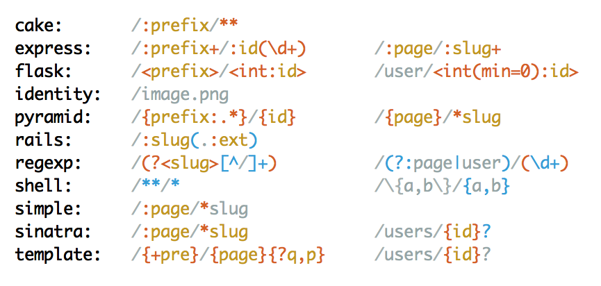
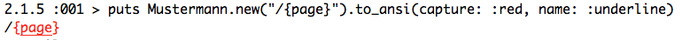
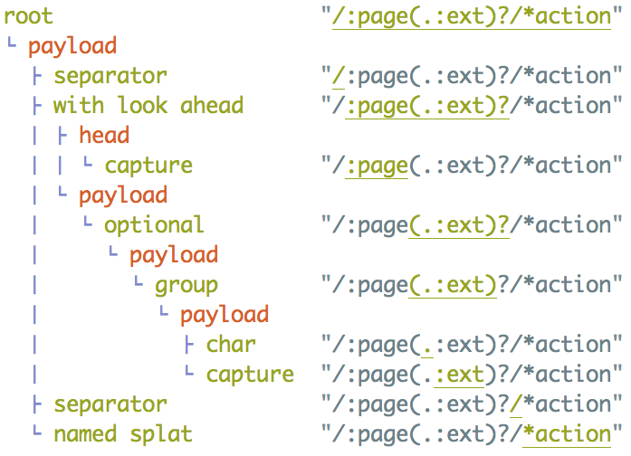

# The Amazing Mustermann - Contrib Edition

This is a meta gem that depends on all mustermann gems.

``` console
$ gem install mustermann-contrib
Successfully installed mustermann-1.0.0
Successfully installed mustermann-contrib-1.0.0
...
```

Also handy for your `Gemfile`:

``` ruby
gem 'mustermann-contrib'
```

Alternatively, you can use latest HEAD from github:

```ruby
github 'sinatra/mustermann' do
  gem 'mustermann'
  gem 'mustermann-contrib'
end
```

<a name="-mustermann-cake"></a>
# CakePHP Syntax for Mustermann

See [docs/patterns/cake.md](../docs/patterns/cake.md).


<a name="-mustermann-express"></a>
# Express Syntax for Mustermann

See [docs/patterns/express.md](../docs/patterns/express.md).

<a name="-mustermann-fileutils"></a>
# FileUtils for Mustermann

This gem implements efficient file system operations for Mustermann patterns.

## Globbing

All operations work on a list of files described by one or more pattern.

``` ruby
require 'mustermann/file_utils'

Mustermann::FileUtils[':base.:ext'] # => ['example.txt']

Mustermann::FileUtils.glob(':base.:ext') do |file, params|
  file   # => "example.txt"
  params # => {"base"=>"example", "ext"=>"txt"}
end
```

To avoid having to loop over all files and see if they match, it will generate a glob pattern resembling the Mustermann pattern as closely as possible.

``` ruby
require 'mustermann/file_utils'

Mustermann::FileUtils.glob_pattern('/:name')                  # => '/*'
Mustermann::FileUtils.glob_pattern('src/:path/:file.(js|rb)') # => 'src/**/*/*.{js,rb}'
Mustermann::FileUtils.glob_pattern('{a,b}/*', type: :shell)   # => '{a,b}/*'

pattern = Mustermann.new('/foo/:page', '/bar/:page') # => #<Mustermann::Composite:...>
Mustermann::FileUtils.glob_pattern(pattern)          # => "{/foo/*,/bar/*}"
```

## Mapping

It is also possible to search for files and have their paths mapped onto another path in one method call:

``` ruby
require 'mustermann/file_utils'

Mustermann::FileUtils.glob_map(':base.:ext' => ':base.bak.:ext') # => {'example.txt' => 'example.bak.txt'}
Mustermann::FileUtils.glob_map(':base.:ext' => :base) { |file, mapped| mapped } # => ['example']
```

This mechanism allows things like copying, renaming and linking files:

``` ruby
require 'mustermann/file_utils'

# copies example.txt to example.bak.txt
Mustermann::FileUtils.cp(':base.:ext' => ':base.bak.:ext')

# copies Foo.app/example.txt to Foo.back.app/example.txt
Mustermann::FileUtils.cp_r(':base.:ext' => ':base.bak.:ext')

# creates a symbolic link from bin/example to lib/example.rb
Mustermann::FileUtils.ln_s('lib/:name.rb' => 'bin/:name')
```

<a name="-mustermann-mapper"></a>
# Mapper for Mustermann

## Overview

`Mustermann::Mapper` transforms strings according to a set of pattern mappings. Each mapping pairs an input pattern (used to extract parameters) with one or more output patterns (used to expand the result). All mappings that match are applied in insertion order.

``` ruby
require 'mustermann/mapper'

mapper = Mustermann::Mapper.new("/:page(.:format)?" => ["/:page/view.:format", "/:page/view.html"])
mapper['/foo']     # => "/foo/view.html"
mapper['/foo.xml'] # => "/foo/view.xml"
mapper['/foo/bar'] # => "/foo/bar"
```

You can also pass additional values at conversion time to supplement or override captured parameters:

``` ruby
mapper = Mustermann::Mapper.new("/:example" => "(/:prefix)?/:example.html")
mapper['/foo', prefix: 'en']  # => "/en/foo.html"
```

## Building a Mapper

Mappings can be supplied as a hash, added via `[]=`, or built with a block:

``` ruby
# Hash argument
mapper = Mustermann::Mapper.new("/:a" => "/:a.html", "/:a/:b" => "/:b/:a")

# Block (zero-argument, returns a hash)
mapper = Mustermann::Mapper.new { { "/:a" => "/:a.html" } }

# Block (one-argument, imperative)
mapper = Mustermann::Mapper.new do |m|
  m["/:a"] = "/:a.html"
end

# Incremental
mapper = Mustermann::Mapper.new
mapper["/:a"] = "/:a.html"
```

The output value may be a String, a `Mustermann::Pattern`, an `Array` of either (tried in order until one expands successfully), or a `Mustermann::Expander` directly.

<a name="-mustermann-flask"></a>
# Flask Syntax for Mustermann

See [docs/patterns/flask.md](../docs/patterns/flask.md).

<a name="-mustermann-pyramid"></a>
# Pyramid Syntax for Mustermann

See [docs/patterns/pyramid.md](../docs/patterns/pyramid.md).

<a name="-mustermann-shell"></a>
# Shell Syntax for Mustermann

See [docs/patterns/shell.md](../docs/patterns/shell.md).


<a name="-mustermann-simple"></a>
# Simple Syntax for Mustermann

See [docs/patterns/simple.md](../docs/patterns/simple.md).

<a name="-mustermann-strscan"></a>
# String Scanner for Mustermann

This gem implements `Mustermann::StringScanner`, a tool inspired by Ruby's [`StringScanner`]() class.

``` ruby
require 'mustermann/string_scanner'
scanner = Mustermann::StringScanner.new("here is our example string")

scanner.scan("here") # => "here"
scanner.getch        # => " "

if scanner.scan(":verb our")
  scanner.scan(:noun, capture: :word)
  scanner[:verb]  # => "is"
  scanner[:nound] # => "example"
end

scanner.rest # => "string"
```

You can pass it pattern objects directly:

``` ruby
pattern = Mustermann.new(':name')
scanner.check(pattern)
```

Or have `#scan` (and other methods) check these for you.

``` ruby
scanner.check('{name}', type: :template)
```

You can also pass in default options for ad hoc patterns when creating the scanner:

``` ruby
scanner = Mustermann::StringScanner.new(input, type: :shell)
```

<a name="-mustermann-to-pattern"></a>
# `to_pattern` for Mustermann

## Overview

`mustermann/to_pattern` adds a `to_pattern` method to `String`, `Symbol`, `Regexp`, `Array`, and `Mustermann::Pattern`, and provides the `Mustermann::ToPattern` mixin so you can add the same method to your own classes.

``` ruby
require 'mustermann/to_pattern'

"/foo".to_pattern               # => #<Mustermann::Sinatra:"/foo">
"/foo".to_pattern(type: :rails) # => #<Mustermann::Rails:"/foo">
%r{/foo}.to_pattern             # => #<Mustermann::Regular:"\\/foo">
"/foo".to_pattern.to_pattern    # => #<Mustermann::Sinatra:"/foo">
```

## `Mustermann::ToPattern` mixin

Include `Mustermann::ToPattern` in any class to get a `to_pattern` method driven by its `to_s` output:

``` ruby
require 'mustermann/to_pattern'

class MyRoute
  include Mustermann::ToPattern

  def to_s
    "/users/:id"
  end
end

MyRoute.new.to_pattern               # => #<Mustermann::Sinatra:"/users/:id">
MyRoute.new.to_pattern(type: :rails) # => #<Mustermann::Rails:"/users/:id">
```

If your class wraps another object (via `__getobj__`, as in `Delegator` subclasses), `to_pattern` will unwrap it before converting.

<a name="-mustermann-uri-template"></a>
# URI Template Syntax for Mustermann

See [docs/patterns/template.md](../docs/patterns/template.md).


<a name="-mustermann-visualizer"></a>
# Mustermann Pattern Visualizer

With this gem, you can visualize the internal structure of a Mustermann pattern:

* You can generate a **syntax highlighted** version of a pattern object. Both HTML/CSS based highlighting and ANSI color code based highlighting is supported.
* You can turn a pattern object into a **tree** (with ANSI color codes) representing the internal AST. This of course only works for AST based patterns.

## Syntax Highlighting



Loading `mustermann/visualizer` will automatically add `to_html` and `to_ansi` to pattern objects.

``` ruby
require 'mustermann/visualizer'
puts Mustermann.new('/:name').to_ansi
puts Mustermann.new('/:name').to_html
```

Alternatively, you can also create a separate `highlight` object, which allows finer grained control and more formats:

``` ruby
require 'mustermann/visualizer'

pattern   = Mustermann.new('/:name')
highlight = Mustermann::Visualizer.highlight(pattern)

puts highlight.to_ansi
```
### `inspect` mode

By default, the highlighted string will be a colored version of `to_s`. It is also possible to produce a colored version of `inspect`

``` ruby
require 'mustermann/visualizer'

pattern = Mustermann.new('/:name')

# directly from the pattern
puts pattern.to_ansi(inspect: true)

# via the highlighter
highlight = Mustermann::Visualizer.highlight(pattern, inspect: true)
puts highlight.to_ansi
```

### Themes



element      | inherits style from | default theme | note
-------------|---------------------|---------------|-------------------------
default      |                     | #839496       | ANSI `\e[10m` if not set
special      | default             | #268bd2       |
capture      | special             | #cb4b16       |
name         |                     | #b58900       | always inside `capture`
char         | default             |               |
expression   | capture             |               | only exists in URI templates
composition  | special             |               | meta style, does not exist directly
composite    | composition         |               | used for composite patterns (contains `root`s)
group        | composition         |               |
union        | composition         |               |
optional     | special             |               |
root         | default             |               | wraps the whole pattern
separator    | char                | #93a1a1       |
splat        | capture             |               |
named_splat  | splat               |               |
variable     | capture             |               | always inside `expression`
escaped      | char                | #93a1a1       |
escaped_char |                     |               | always inside `escaped`
quote        | special             | #dc322f       | always outside of `root`
type         | special             |               | always inside `composite`, outside of `root`
illegal      | special             | #8b0000       |

You can set theme any of the above elements. The default theme will only be applied if no custom theming is used.

``` ruby
# custom theme with highlight object
highlight = Mustermann::Visualizer.highlight(pattern, special: "#08f")
puts highlight.to_ansi
```

Themes apply both to ANSI and to HTML/CSS output. The exact ANSI code used depends on the terminal and its capabilities.

### HTML and CSS

By default, the syntax elements will be translated into `span` tags with `style` attributes.

``` ruby
Mustermann.new('/:name').to_html
```

``` html
<span style="color: #839496;"><span style="color: #93a1a1;">/</span><span style="color: #cb4b16;">:<span style="color: #b58900;">name</span></span></span></span>
```

You can also set the `css` option to `true` to make it include a stylesheet instead.

``` ruby
Mustermann.new('/:name').to_html(css: true)
```

``` html
<span class="mustermann_pattern"><style type="text/css">
.mustermann_pattern .mustermann_name {
  color: #b58900;
}
/* ... etc ... */
</style><span class="mustermann_root"><span class="mustermann_separator">/</span><span class="mustermann_capture">:<span class="mustermann_name">name</span></span></span></span>
```

Or you can set it to `false`, which will omit `style` attributes, but include `class` attributes.

``` html
<span class="mustermann_pattern"><span class="mustermann_root"><span class="mustermann_separator">/</span><span class="mustermann_capture">:<span class="mustermann_name">name</span></span></span></span>
```

It is possible to change the class prefix and the tag used.

``` ruby
Mustermann.new('/:name').to_html(css: false, class_prefix: "mm_", tag: "tt")
```

``` html
<tt class="mm_pattern"><tt class="mm_root"><tt class="mm_separator">/</tt><tt class="mm_capture">:<tt class="mm_name">name</tt></tt></tt></tt>
```

If you create a highlight object, you can ask it for its `stylesheet`.

``` erb
<% highlight = Mustermann::Visualizer.highlight("/:name") %>

<html>
  <head>
    <style type="text/css">
      <%= highlight.stylesheet %>
    </style>
  </head>
  <body>
    <%= highlight.to_html(css: false) %>
  </body>
</html>
```


### Other formats

If you create a highlight object, you have two other formats available: Hansi template strings and s-expression like strings. These might be useful if you want to check how a theme will be applied or as intermediate format for highlighting by other means.

``` ruby
require 'mustermann/visualizer'
highlight = Mustermann::Visualizer.highlight("/:page")
puts highlight.to_hansi_template
puts highlight.to_sexp
```

**Hansi template strings** wrap elements in tags that are similar to XML tags (though they are not, entity encoding and attributes are not supported, escaping works with a slash, so an escaped `>` would be `\>`, not `&gt;`).

``` xml
<pattern><root><separator>/</separator><capture>:<name>page</name></capture></root></pattern>
```

The **s-expression like syntax** looks as follows:

```
(root (separator /) (capture : (name page)))
```

* An expression is enclosed by parens and contains elements separated by spaces. The first element in the expression type (corresponding to themeable elements). These are simple strings. The other elements are either expressions, simple strings or full strings.
* Simple strings do not contain spaces, parens, single or double quotes or any character that needs to be escaped.
* Full strings are Ruby strings enclosed by double quotes.
* Spaces before or after parens are optional.

## Tree Rendering



Loading `mustermann/visualizer` will automatically add `to_tree` to pattern objects.

``` ruby
require 'mustermann/visualizer'
puts Mustermann.new("/:page(.:ext)?/*action").to_tree
```

For patterns not based on an AST (shell, simple, regexp), it will print out a single line:

    pattern (not AST based)  "/example"

It will display a tree for identity patterns. While these are not based on an AST internally, Mustermann supports generating an AST for these patterns.
