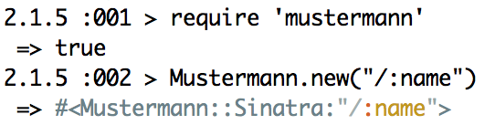
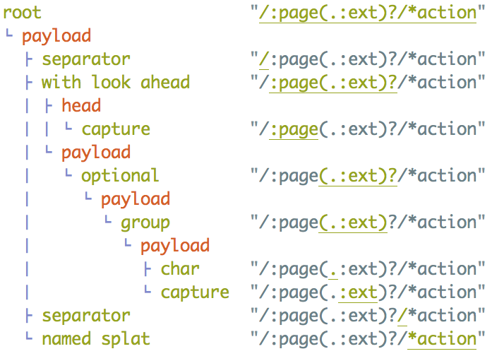

# Mustermann Pattern Visualizer

With this gem, you can visualize the internal structure of a Mustermann pattern:

* You can generate a **syntax highlighted** version of a pattern object. Both HTML/CSS based highlighting and ANSI color code based highlighting is supported.
* You can turn a pattern object into a **tree** (with ANSI color codes) representing the internal AST. This of course only works for AST based patterns.

## Syntax Highlighting


Loading `mustermann/visualizer` will automatically add `to_html` and `to_ansi` to pattern objects.

``` ruby
require 'mustermann/visualizer'
puts Mustermann.new('/:name').to_ansi
puts Mustermann.new('/:name').to_html
```

Alternatively, you can also create a separate `highlight` object, which allows finer grained control and more formats:

``` ruby
require 'mustermann/visualizer'

pattern   = Mustermann.new('/:name')
highlight = Mustermann::Visualizer.highlight(pattern)

puts highlight.to_ansi
```
### `inspect` mode

By default, the highlighted string will be a colored version of `to_s`. It is also possible to produce a colored version of `inspect`

``` ruby
require 'mustermann/visualizer'

pattern = Mustermann.new('/:name')

# directly from the pattern
puts pattern.to_ansi(inspect: true)

# via the highlighter
highlight = Mustermann::Visualizer.highlight(pattern, inspect: true)
puts highlight.to_ansi
```

### Themes


element      | inherits style from | default theme | note
-------------|---------------------|---------------|-------------------------
default      |                     | #839496       | ANSI `\e[10m` if not set
special      | default             | #268bd2       |
capture      | special             | #cb4b16       |
name         |                     | #b58900       | always inside `capture`
char         | default             |               |
expression   | capture             |               | only exists in URI templates
composition  | special             |               | meta style, does not exist directly
group        | composition         |               |
union        | composition         |               |
optional     | special             |               |
root         | default             |               | wraps the whole pattern
separator    | char                | #93a1a1       |
splat        | capture             |               |
named_splat  | splat               |               |
variable     | capture             |               | always inside `expression`
escaped      | char                | #93a1a1       |
escaped_char |                     |               | always inside `escaped`
quote        | special             |               |
illegal      | special             | #8b0000       |

You can set theme any of the above elements. The default theme will only be applied if no custom theming is used.

``` ruby
# custom theme with highlight object
highlight = Mustermann::Visualizer.highlight(pattern, special: "#08f")
puts highlight.to_ansi
```

Themes apply both to ANSI and to HTML/CSS output. The exact ANSI code used depends on the terminal and its capabilities.

### HTML and CSS

By default, the syntax elements will be translated into `span` tags with `style` attributes.

``` ruby
Mustermann.new('/:name').to_html
```

``` html
<span style="color: #839496;"><span style="color: #93a1a1;">/</span><span style="color: #cb4b16;">:<span style="color: #b58900;">name</span></span></span></span>
```

You can also set the `css` option to `true` to make it include a stylesheet instead.

``` ruby
Mustermann.new('/:name').to_html(css: true)
```

``` html
<span class="mustermann_pattern"><style type="text/css">
.mustermann_pattern .mustermann_name {
  color: #b58900;
}
/* ... etc ... */
</style><span class="mustermann_root"><span class="mustermann_separator">/</span><span class="mustermann_capture">:<span class="mustermann_name">name</span></span></span></span>
```

Or you can set it to `false`, which will omit `style` attributes, but include `class` attributes.

``` html
<span class="mustermann_pattern"><span class="mustermann_root"><span class="mustermann_separator">/</span><span class="mustermann_capture">:<span class="mustermann_name">name</span></span></span></span>
```

It is possible to change the class prefix and the tag used.

``` ruby
Mustermann.new('/:name').to_html(css: false, class_prefix: "mm_", tag: "tt")
```

``` html
<tt class="mm_pattern"><tt class="mm_root"><tt class="mm_separator">/</tt><tt class="mm_capture">:<tt class="mm_name">name</tt></tt></tt></tt>
```

If you create a highlight object, you can ask it for its `stylesheet`.

``` erb
<% highlight = Mustermann::Visualizer.highlight("/:name") %>

<html>
  <head>
    <style type="text/css">
      <%= highlight.stylesheet %>
    </style>
  </head>
  <body>
    <%= highlight.to_html(css: false) %>
  </body>
</html>
```


### Other formats

If you create a highlight object, you have two other formats available: Hansi template strings and s-expression like strings. These might be useful if you want to check how a theme will be applied or as intermediate format for highlighting by other means.

``` ruby
require 'mustermann/visualizer'
highlight = Mustermann::Visualizer.highlight("/:page")
puts highlight.to_hansi_template
puts highlight.to_sexp
```

**Hansi template strings** wrap elements in tags that are similar to XML tags (though they are not, entity encoding and attributes are not supported, escaping works with a slash, so an escaped `>` would be `\>`, not `&gt;`).

``` xml
<pattern><root><separator>/</separator><capture>:<name>page</name></capture></root></pattern>
```

The **s-expression like syntax** looks as follows:

```
(root (separator /) (capture : (name page)))
```

* An expression is enclosed by parens and contains elements separated by spaces. The first element in the expression type (corresponding to themeable elements). These are simple strings. The other elements are either expressions, simple strings or full strings.
* Simple strings do not contain spaces, parens, single or double quotes or any character that needs to be escaped.
* Full strings are Ruby strings enclosed by double quotes.
* Spaces before or after parens are optional.

### IRB/Pry integration

When `mustermann` is being loaded from within an IRB or Pry session, it will automatically load `mustermann/visualizer` too, if possible.
When displayed as result, it will be highlighted.



In Pry, this will even work when nested inside other objects (like as element on an array).

## Tree Rendering



Loading `mustermann/visualizer` will automatically add `to_tree` to pattern objects.

``` ruby
require 'mustermann/visualizer'
puts Mustermann.new("/:page(.:ext)?/*action").to_tree
```

For patterns not based on an AST (shell, simple, regexp), it will print out a single line:

    pattern (not AST based)  "/example"

It will display a tree for identity patterns. While these are not based on an AST internally, Mustermann supports generating an AST for these patterns.